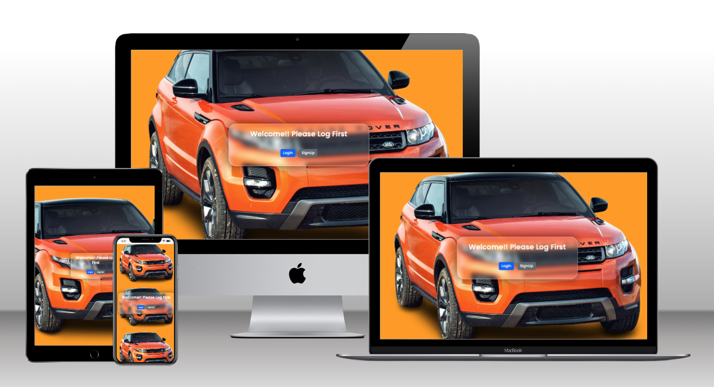
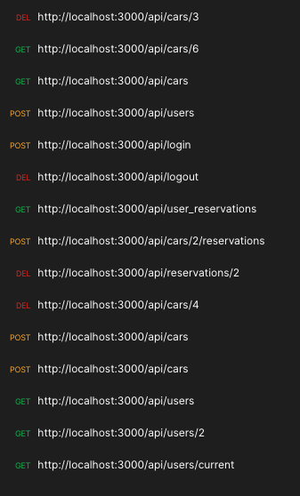

  <h3><b>final_capstone_back_end</b></h3>

# 📗 Table of Contents

- [📗 Table of Contents](#-table-of-contents)
- [📖 final\_capstone\_back\_end ](#-final_capstone_back_end-)
  - [🛠 ER Diagram ](#-er-diagram-)
  - [💻 link to front end ](#-link-to-front-end-)
  - [💻 link to Kanban board information ](#-link-to-kanban-board-information-)
  - [🛠 Built With ](#-built-with-)
    - [Tech Stack ](#tech-stack-)
    - [Key Features ](#key-features-)
  - [💻 Getting Started ](#-getting-started-)
    - [Prerequisites](#prerequisites)
    - [Setup](#setup)
    - [Install](#install)
    - [Usage](#usage)
  - [💻 API Documentation ](#-api-documentation-)
  - [👥 Authors ](#-authors-)
  - [🔭 Future Features ](#-future-features-)
  - [🤝 Contributing ](#-contributing-)
  - [⭐️ Show your support ](#️-show-your-support-)
  - [🙏 Acknowledgments ](#-acknowledgments-)
  - [❓ FAQ (OPTIONAL) ](#-faq-optional-)
  - [📝 License ](#-license-)

# 📖 final_capstone_back_end 

**final_capstone_back_end** The back-end component of this final capstone project is developed using Ruby on Rails, configured to serve as an API. This API is designed to facilitate reservations or appointments for test drives of cars. It leverages a PostgreSQL database to manage and store reservation data.

## 🛠 ER Diagram 

(<a href="#readme-top">back to top</a>)

## 💻 link to front end 

[Link to Front End](https://github.com/ClaudiaRojasSoto/Final-Capstone-Front-End)

(<a href="#readme-top">back to top</a>)

## 💻 link to Kanban board information 

[Link to Kanban Board](https://github.com/ClaudiaRojasSoto/Final-Capstone-Back-End/projects/1)

[Initial state](https://github.com/ClaudiaRojasSoto/Final-Capstone-Back-End/issues/16)

This project was completed by two of the three original Team members:

- Pablo Bonasera
- Claudia Rojas

(<a href="#readme-top">back to top</a>)

## 🛠 Built With 

### Tech Stack 

  
Technologies

  <ul>
    <li><a href="https://rubyonrails.org/">Ruby on Rails</a></li>
  </ul>

Linters

  <ul>
    <li>Rubocop</li>
  </ul>

### Key Features 

- [x] **Ruby on Rails**
- [x] **API Endpoint**
- [x] **Professional Documentation**
- [x] **Linting for Code Quality**
- [x] **Postgres Database**
- [x] **Git Version Control**

(<a href="#readme-top">back to top</a>)

## 💻 Getting Started 

To get a local copy up and running, follow these steps.

### Prerequisites

Before you begin, make sure you have the following prerequisites installed on your system:

- Ruby: You need Ruby to run the Ruby on Rails application.
- Bundler: Bundler is used to manage gem dependencies in your Ruby project.

### Setup

Clone this repository to your desired folder:

sh  
cd my-folder  
git clone https://github.com/ClaudiaRojasSoto/final_capstone_back_end.git

### Install

Install this project with:

- gem install rails
- bundle install

### Usage

To run the project, execute the following command:

rails server

## 💻 API Documentation 

[Run in Postman](https://winter-desert-419071.postman.co/workspace/My-Workspace~efdb5aba-9d35-41c3-848e-87060938ceb9/collection/19270283-b003a584-76ab-4464-8520-ecbd8d4677df?action=share&creator=19270283)

(<a href="#readme-top">back to top</a>)

## 👥 Authors 

👤 **Claudia Rojas**

- GitHub: [@ClaudiaRojas](https://github.com/ClaudiaRojasSoto)
- LinkedIn: [@ClaudiaRojas](https://www.linkedin.com/in/claudia-rojas-soto/)

👤 **Pablo Bonasera**

- GitHub: [@PabloBona](https://github.com/PabloBona)
- LinkedIn: [Pablo Bonasera](https://www.linkedin.com/in/pablo-bonasera/)

(<a href="#readme-top">back to top</a>)

## 🔭 Future Features 

- [ ] **Implement proper user authentication from the front-end to the server**
- [ ] **Add authorizations to users**

(<a href="#readme-top">back to top</a>)

## 🤝 Contributing 

Contributions, issues, and feature requests are welcome!

Feel free to check the [issues page](https://github.com/ClaudiaRojasSoto/final_capstone_back_end/issues).

(<a href="#readme-top">back to top</a>)

## ⭐️ Show your support 

If you like this project please feel free to send me corrections for make it better I would feel glad to read your comments.
And think If you enjoy gift me a star.  

(<a href="#readme-top">back to top</a>)

## 🙏 Acknowledgments 

- Behance and Murat Korkmaz for the [original design](https://www.behance.net/gallery/26425031/Vespa-Responsive-Redesign)
- Microverse for providing the opportunity to learn in a collaborative environment.
- React.js Documentation for valuable resources on React development.
- GitHub for version control and collaboration tools.

(<a href="#readme-top">back to top</a>)

## ❓ FAQ (OPTIONAL) 

- **Can I use with a templeate your project?**

  - Of course I would feel honored

- **Your project is free license?**

  - Yeah, you can use it completely

(<a href="#readme-top">back to top</a>)

## 📝 License 

This project is licensed under the MIT License - you can click here to have more details [MIT](MIT.md).

(<a href="#readme-top">back to top</a>)

